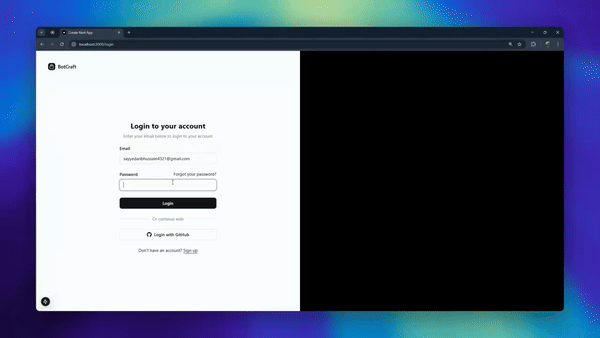

# Botcraft App - Low Code AI Chatbot Platform 
By Imaad Hasan and Sayyed Aarib Hussain

Built as a part of our final year project for Zakir Husain College of Engineering and Technology, AMU, Aligarh.

A full-stack AI chatbot platform with a FastAPI backend and Next.js frontend.



The frontend is built with [Next.js](https://nextjs.org) and uses [`next/font`](https://nextjs.org/docs/app/building-your-application/optimizing/fonts) to automatically optimize and load [Geist](https://vercel.com/font).

## 📁 Project Structure

```
botcraft/
├── apps/
│   ├── backend/          # FastAPI Python backend
│   │   ├── app/
│   │   │   ├── api/      # API routes
│   │   │   ├── core/     # Core configurations
│   │   │   ├── models/   # Database models
│   │   │   ├── repositories/  # Data access layer
│   │   │   ├── services/ # Business logic
│   │   │   ├── utils/    # Utility functions
│   │   │   └── workers/  # Background workers
│   │   ├── requirements.txt
│   │   └── Dockerfile
│   │
│   └── frontend/         # Next.js React frontend
│       ├── src/
│       │   ├── app/      # App router pages
│       │   ├── components/
│       │   ├── hooks/
│       │   ├── lib/
│       │   ├── providers/
│       │   ├── stores/
│       │   └── types/
│       ├── public/
│       ├── package.json
│       └── Dockerfile
│
├── packages/             # Shared packages (future)
├── docker-compose.yml    # Docker orchestration
├── package.json          # Root package.json with scripts
├── .env.example          # Environment variables template
└── README.md
```

## 🚀 Quick Start

### Prerequisites

- Node.js >= 18.0.0
- Python >= 3.10
- MongoDB (local, Docker, or Atlas)
- Redis (only for background Celery jobs — optional in dev)
- Docker & Docker Compose (optional)

External services (set keys in `.env`; the API boots without them but the
related features are disabled):
- **OpenAI** — chatbot responses
- **Pinecone** — vector storage + hosted embeddings
- **AWS S3** — PDF storage

### Installation

1. **Clone the repository**
   ```bash
   git clone https://github.com/your-org/botcraft.git
   cd botcraft
   ```

2. **Set up environment variables**
   ```bash
   cp .env.example .env
   # Edit .env with your configuration
   ```

3. **Install all dependencies**
   ```bash
   npm run install:all
   ```

   > Optional: local sentence-transformers embedding models (pulls PyTorch ~2 GB):
   > `pip install -r apps/backend/requirements-ml.txt`

4. **Run in development mode**
   ```bash
   npm run dev
   ```

   This will start:
   - Backend API at http://localhost:8000
   - Frontend at http://localhost:3000

### Alternative: Docker Setup

```bash
# Build and start all services
npm run docker:up

# View logs
docker-compose logs -f

# Stop services
npm run docker:down
```

## 📜 Available Scripts

| Command | Description |
|---------|-------------|
| `npm run dev` | Start both frontend and backend in development mode |
| `npm run dev:backend` | Start only the backend server |
| `npm run dev:frontend` | Start only the frontend server |
| `npm run build` | Build the frontend for production |
| `npm run start` | Start both services in production mode |
| `npm run test` | Run backend tests |
| `npm run lint` | Lint the frontend code |
| `npm run install:all` | Install all dependencies (npm + pip) |
| `npm run docker:up` | Start all services with Docker |
| `npm run docker:down` | Stop all Docker services |
| `npm run clean` | Remove all node_modules and build artifacts |

## 🛠️ Tech Stack

### Backend
- **Framework**: FastAPI
- **Database**: MongoDB with Beanie ODM
- **Vector DB**: Pinecone
- **AI/ML**: LangChain, OpenAI
- **Task Queue**: Celery + Redis
- **File Storage**: AWS S3

### Frontend
- **Framework**: Next.js 15 (App Router)
- **UI**: Radix UI + Tailwind CSS
- **State Management**: TanStack Query + Zustand
- **Forms**: React Hook Form + Zod

## 🔧 Configuration

### Backend Configuration

Edit `apps/backend/app/core/config.py` or use environment variables:

```python
# Key settings
MONGODB_URL=mongodb://localhost:27017
REDIS_URL=redis://localhost:6379
OPENAI_API_KEY=your-api-key
PINECONE_API_KEY=your-api-key
```

### Frontend Configuration

Edit `apps/frontend/.env.local`:

```env
NEXT_PUBLIC_API_URL=http://localhost:8000
NEXT_PUBLIC_WS_URL=ws://localhost:8000
```

## 🏗️ Development

### Backend Development

```bash
cd apps/backend

# Create virtual environment
python -m venv venv
source venv/bin/activate  # On Windows: venv\Scripts\activate

# Install dependencies
pip install -r requirements.txt

# Run server
uvicorn app.main:app --reload --port 8000
```

### Frontend Development

```bash
cd apps/frontend

# Install dependencies
npm install

# Run development server
npm run dev
# or: yarn dev | pnpm dev | bun dev
```

Open [http://localhost:3000](http://localhost:3000) in your browser. Edit `apps/frontend/src/app/page.tsx` to get started—the page auto-updates as you edit.

## 🧪 Testing

### Backend Tests

The test suite uses an in-memory MongoDB (mongomock) — no databases,
API keys, or network access required.

```bash
cd apps/backend
pytest -v          # 18 tests: auth, workspaces, themes, configs, services
```

### Frontend Checks
```bash
cd apps/frontend
npx tsc --noEmit   # type check
npm run lint       # ESLint
npm run build      # production build
```

## 📦 Deployment

### Using Docker (Recommended)

1. Create `.env` from `.env.example` and fill in real values. Note:
   `NEXT_PUBLIC_API_URL` / `NEXT_PUBLIC_WS_URL` are baked into the frontend
   bundle at **build** time and must be the URL the *browser* uses to reach
   the backend (e.g. `https://api.example.com`, not `http://backend:8000`).

2. Build and start:
   ```bash
   docker-compose build
   docker-compose up -d
   docker-compose ps          # backend has a /health healthcheck
   ```

   Services: backend (8000), frontend (3000), MongoDB (27017), Redis (6379),
   and a Celery worker for background file processing.

### Manual Deployment

#### Backend
```bash
cd apps/backend
pip install -r requirements.txt
uvicorn app.main:app --host 0.0.0.0 --port 8000
```

#### Frontend
```bash
cd apps/frontend
npm run build
npm run start
```

## 📄 API Documentation

Once the backend is running, access:
- Swagger UI: http://localhost:8000/docs
- ReDoc: http://localhost:8000/redoc
- OpenAPI JSON: http://localhost:8000/api/v1/openapi.json
- Health check: http://localhost:8000/health (reports MongoDB connectivity)

## 📚 Learn More

- [Next.js Documentation](https://nextjs.org/docs) - Next.js features and API
- [Learn Next.js](https://nextjs.org/learn) - Interactive Next.js tutorial
- [Next.js GitHub repository](https://github.com/vercel/next.js)

## ☁️ Deploy on Vercel

The easiest way to deploy the Next.js frontend is via the [Vercel Platform](https://vercel.com/new?utm_medium=default-template&filter=next.js&utm_source=create-next-app&utm_campaign=create-next-app-readme). See the [Next.js deployment documentation](https://nextjs.org/docs/app/building-your-application/deploying) for details.

## 🤝 Contributing

1. Fork the repository
2. Create your feature branch (`git checkout -b feature/amazing-feature`)
3. Commit your changes (`git commit -m 'Add some amazing feature'`)
4. Push to the branch (`git push origin feature/amazing-feature`)
5. Open a Pull Request

## 🔧 Maintenance Notes

- **Dependencies are pinned** in `apps/backend/requirements.txt` and
  `apps/frontend/package-lock.json`. Upgrade deliberately, run the test
  suite, and re-pin. Do **not** upgrade `beanie` to 2.x without migrating
  off Motor (2.x removed Motor support).
- **Secrets** live only in `.env` (gitignored). Generate `SECRET_KEY` with
  `openssl rand -hex 32`. Set `DEBUG=false` in production (enables secure
  cookies).
- **CI** (`.github/workflows/ci.yml`) runs backend tests and the frontend
  lint + build on every push/PR to `main`/`develop`. Keep it green.
- See [RECOVERY.md](RECOVERY.md) for the June 2026 recovery audit: every
  issue found, its severity, and how it was fixed.

## 📝 License

This project is licensed under the MIT License - see the [LICENSE](LICENSE) file for details.
